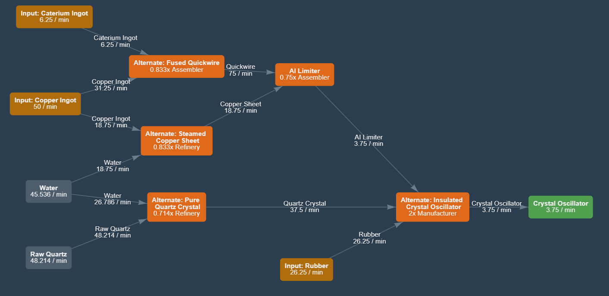

# Insulated crystal oscillators with refineries

### [IN]
6.25 caterium ingot
50 copper ingot
48.214 quartz ore
45.536 water
26.25 rubber
### [OUT]
3.75 crystal oscillator

Refineries for quartz crystal and copper sheet

