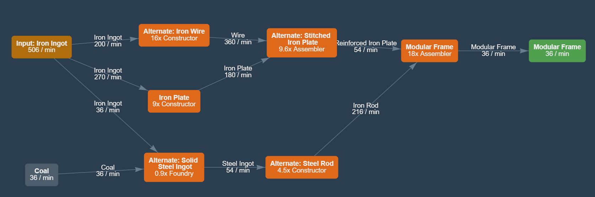

# Huge Modular Frames Factory

### [IN]
506 iron INGOTS (4 inputs of 117.5 each + a refinery of 36)
36 coal
### [OUT]
36 modular frames

Uses stitched plates blueprint.
Coal could be replaced for more iron to craft into rods.

