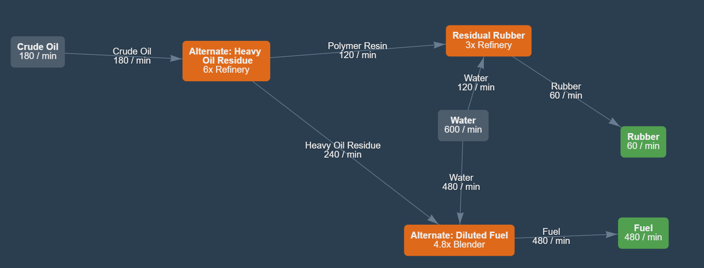

### [IN]
180 oil
300 water

### [OUT]
60 rubber
480 fuel

### [SIZE]
6.5x9.5 foundations

Used to feed into an alchemy plant.
Now uses blenders to avoid packagers. Also some Mk2 pipelines and quartz for signaling.

